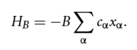
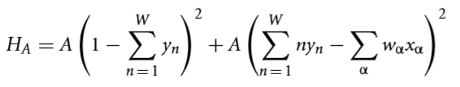
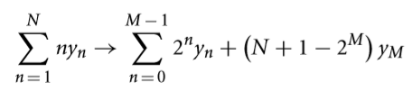

[](
  https://circleci.com/gh/dwave-examples/knapsack)

# Knapsack

Consider a problem found in packing shipping containers on docks. There is a
collection of objects; each object has a value, and a weight. The shipping
container has a weight capacity which it can hold. The goal is to pack the
shipping container in order to:

1) maximize the sum total of the values of the objects put into the container.
2) fill up the container so that the total weight is less than or equal to the
   container's capacity.

This well-known optimization problem is known as the knapsack problem.
To solve this problem on a D-Wave system, we reformulate it as a quadratic
unconstrained binary optimization problem (QUBO).

## Usage

To run a small demo, run the command:

```bash
python knapsack.py data/small.csv 50
```

The command-line arguments specify the Python program, a small data set, and the
maximum weight (in kilograms). The small data set file includes objects,
provided as pairs (weight, value).  The answer should include three objects,
with combined weight of 45 kg, below the maximum of 50 kg. Their summed value is
205, which agrees with the reported energy.

To run the full demo, run the command:

```bash
python knapsack.py
```

To run a bigger demo, run the command:

```bash
python knapsack.py data/very_large.csv 190
```

To run a much bigger demo, run the command:

```bash
python knapsack.py data/huge.csv 400
```

To run a very small demo, run the command:

```bash
python knapsack.py data/very_small.csv 10
```

## Code Overview

The code in `knapsack.py` includes an implementation of the knapsack problem using
auxiliary variables to represent the inequality constraint associated with the
maximum weight.  The formulation is based on the work of Andrew Lucas [1,2].

Each available object is assigned a binary decision variable `x_i`, which
indicates whether it is to be included in the knapsack.  The total energy is
expressed as a sum of two components, `H_A` and `H_B`, where `H_A` penalizes
violation of the problem constraints, and `H_B` represents the objective of
maximizing the value of the selected items.  `H_B` is given by (Ref. [1],
Eq. (50)):



where the `c` coefficients denote the value of each item, and `B` is a scaling
coefficient used to balance `H_A` and `H_B`.

The constraint states that the total weight of the selected items must be less
than or equal to the specified maximum weight.  Because this is an inequality
constraint, it requires the use of additional auxiliary variables, which are
denoted by `y_i`.  Ref. [1] expresses the penalty function `H_A` as (Eq. (49)):



where `W` is the maximum allowed weight, the `w` coefficients denote the
individual item weights, and `A` is a scaling term.  This formulation is based
on the use of `W` binary auxiliary variables to represent all possible values of
the total weight from 1 to `W`.  The first term encodes the requirement that
only one of the auxiliary variables should be active at a given time, and the
second term enforces that the total weight indicated by the auxiliary variables
`y_i` matches that given by the `x_i` indicator variables.  Any total weight for
the `x` variables that exceeds `W` will result in a non-zero penalty.

The code itself makes use of the so-called "logarithm trick" to reduce the
number of auxiliary variables that are required.  This is explained in Section
2.4 of Ref. [1].  The idea is that instead of using N binary variables to
represent integer values from 1 to N, we can express each allowed integer value
as a sum of powers of two, in which case the total number of variables needed is
`M+1`, where `M = floor(log_2(N))`.  This representation is shown in Eq. (20) of
Ref [1]:



With this formulation, the total number of auxiliary variables is reduced, and
the first term in the equation for `H_A` is removed because we do not want to
require that only one of the `y_i` auxiliary variables is active.

## References

[1] Andrew Lucas, "Ising formulations of many NP problems", [doi:
10.3389/fphy.2014.00005](https://www.frontiersin.org/articles/10.3389/fphy.2014.00005/full)

[2] Andrew Lucas, "NP-hard combinatorial problems as Ising spin glasses", Workshop
on Classical and Quantum Optimization; ETH Zuerich - August 20, 2014

## License

Released under the Apache License 2.0. See [LICENSE](LICENSE) file.
